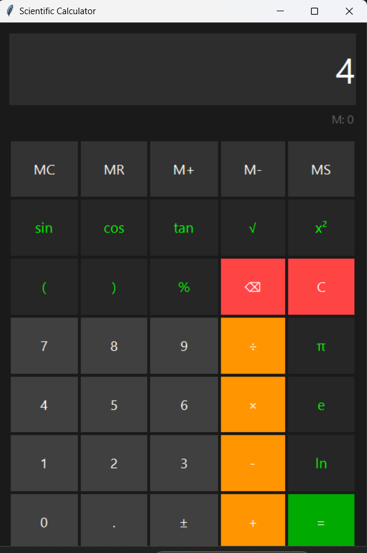

# Scientific Calculator

A modern scientific calculator built with Python and tkinter, featuring a sleek dark theme and advanced mathematical functions.



## Features

### Basic Operations
- Addition, subtraction, multiplication, division
- Parentheses support
- Percentage calculations
- Sign toggle (±)
- Decimal point operations

### Scientific Functions
- Trigonometric functions (sin, cos, tan)
- Square root (√)
- Square power (x²)
- Natural logarithm (ln)
- Mathematical constants (π, e)

### Memory Operations
- Memory Clear (MC)
- Memory Recall (MR)
- Memory Add (M+)
- Memory Subtract (M-)
- Memory Store (MS)

### User Interface
- Modern dark theme
- Large, readable display
- Color-coded buttons for different operations
- Keyboard support
- Error handling

## Requirements
- Python 3.x
- tkinter (usually comes with Python installation)

## Installation

1. Clone the repository:
```bash
git clone https://github.com/Vishalkisu/scientific-calculator.git
```

2. Navigate to the project directory:
```bash
cd scientific-calculator
```

3. Run the calculator:
```bash
python calculator.py
```

## Keyboard Shortcuts
- Numbers: 0-9
- Operations: +, -, *, /
- Equals: Enter or =
- Clear: Esc
- Delete: Backspace
- Decimal: .
- Parentheses: (, )

## Contributing
Pull requests are welcome. For major changes, please open an issue first to discuss what you would like to change.

## License
[MIT](https://choosealicense.com/licenses/mit/)
